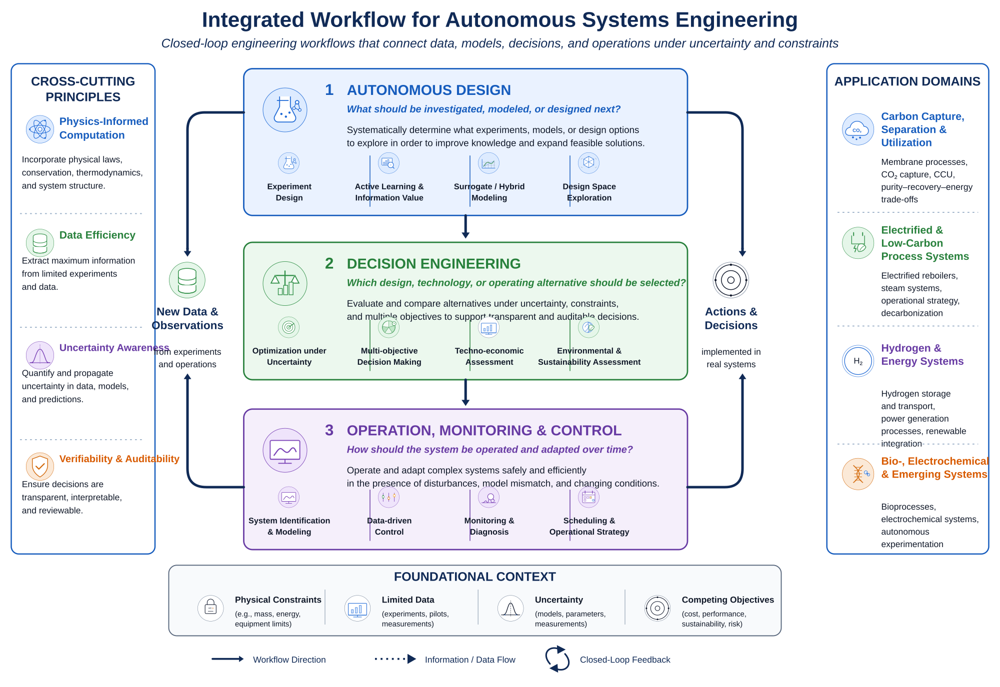

::: {.research-vision}

AUTONOMOUS SYSTEMS ENGINEERING

LASER develops computational workflows that help engineers determine **what to investigate, which alternative to select, and how to operate complex systems** under uncertainty and limited data.

Our research connects autonomous design, decision engineering, and operation into closed-loop engineering workflows grounded in physical knowledge, data, and verifiable computation.

::: {.research-principles}
Physical consistency
Data efficiency
Uncertainty awareness
Verifiability
:::
:::

## Integrated Research Framework

::: {.framework-figure}
::: {.framework-scroll}
[{.research-framework-image fig-alt="Integrated workflow for autonomous systems engineering connecting autonomous design, decision engineering, and operation, monitoring and control."}](laser_autonomous_workflow_editable_preview.png)
:::

LASER studies closed-loop workflows in which experiments and models inform engineering decisions, decisions are implemented in real systems, and new observations improve subsequent design and operation. [Open the full-size figure](laser_autonomous_workflow_editable_preview.png){.framework-link target="_blank"}
:::

## Research Themes

::: {.grid .research-theme-grid}

::: {.g-col-12 .g-col-md-4}
::: {.research-theme-card .theme-blue}

01

### Autonomous Design

What should be investigated, modeled, or designed next?

Autonomous design addresses how experiments, models, and design spaces can be progressively refined with limited data and computational resources. We develop methods that select informative next actions while respecting physical constraints and uncertainty.

**Core methods**

- Sequential and Bayesian experiment design
- Active learning and value of information
- Surrogate and hybrid modeling
- Design-space exploration

<strong>Representative work</strong> <a href="https://doi.org/10.1007/s11814-025-00543-9" target="_blank" rel="noopener">Sequential experimental design</a> · <a href="https://doi.org/10.1007/s11814-024-00362-4" target="_blank" rel="noopener">Piecewise response-surface modeling</a>

:::
:::

::: {.g-col-12 .g-col-md-4}
::: {.research-theme-card .theme-green}

02

### Decision Engineering

Which design, technology, or operating alternative should be selected?

Decision engineering studies how alternatives should be evaluated when objectives conflict, predictions are uncertain, and models are incomplete. The goal is not only to identify an optimum, but also to make the basis and reliability of the decision transparent.

**Core methods**

- Optimization under uncertainty
- Multi-objective decision-making
- Techno-economic assessment
- Environmental and sustainability assessment

<strong>Representative work</strong> <a href="https://doi.org/10.1007/s11814-026-00746-8" target="_blank" rel="noopener">Uncertainty-penalized optimization</a> · <a href="https://doi.org/10.1016/j.cej.2025.169850" target="_blank" rel="noopener">Sustainable blue hydrogen</a>

:::
:::

::: {.g-col-12 .g-col-md-4}
::: {.research-theme-card .theme-purple}

03

### Operation, Monitoring & Control

How should the system be operated and adapted over time?

We develop implementable methods for systems affected by disturbances, model mismatch, changing operating conditions, and limited process knowledge. Our work connects control-oriented modeling, direct data-driven control, monitoring, and operational decision support.

**Core methods**

- System identification and control-oriented modeling
- Direct data-driven controller design
- Monitoring and diagnosis
- Scheduling and operational strategy

<strong>Representative work</strong> <a href="https://doi.org/10.1016/j.compchemeng.2026.109780" target="_blank" rel="noopener">Direct data-driven controller design</a> · <a href="https://doi.org/10.3390/pr12050986" target="_blank" rel="noopener">Robust process identification</a>

:::
:::

:::

## Application Domains

Our methods are developed and tested through engineering problems in which data are costly, physical constraints are important, and decisions have long-term technical or environmental consequences.

::: {.grid .application-grid}

::: {.g-col-12 .g-col-md-6}
::: {.application-card .application-blue}
### Carbon Capture, Separation & Utilization

Membrane gas separation, CO₂ capture and utilization, purity–recovery–energy trade-offs, and process performance and cost assessment.
:::
:::

::: {.g-col-12 .g-col-md-6}
::: {.application-card .application-green}
### Electrified & Low-Carbon Process Systems

Electrified reboilers and thermal systems, process-utility electrification, operational strategy, and decarbonization assessment.
:::
:::

::: {.g-col-12 .g-col-md-6}
::: {.application-card .application-purple}
### Hydrogen & Energy Systems

Hydrogen storage and transport, power-generation process operation, renewable-integrated systems, dynamic optimization, and scheduling.
:::
:::

::: {.g-col-12 .g-col-md-6}
::: {.application-card .application-orange}
### Bio-, Electrochemical & Emerging Systems

Bioprocess and electrochemical-system modeling, autonomous experimentation, technology evaluation, and sustainability assessment.
:::
:::

:::

## Current Research Directions

::: {.grid .direction-grid}

::: {.g-col-12 .g-col-md-6}
::: {.direction-card}

01

### Closed-Loop Experiment–Model–Decision Workflows

Integrating experiment design, model updating, uncertainty assessment, and next-action selection into a unified iterative workflow.
:::
:::

::: {.g-col-12 .g-col-md-6}
::: {.direction-card}

02

### Reliable Data-Driven Operation

Developing implementable control and monitoring methods that remain reliable under model mismatch, limited data, and changing operating conditions.
:::
:::

::: {.g-col-12 .g-col-md-6}
::: {.direction-card}

03

### Autonomous Low-Carbon Process Systems

Connecting process design, sustainability assessment, and adaptive operation for membrane, electrified, hydrogen, and energy systems.
:::
:::

::: {.g-col-12 .g-col-md-6}
::: {.direction-card}

04

### Model and Method Selection

Developing systematic frameworks for selecting models, experimental strategies, surrogates, and optimization methods according to available information and engineering objectives.
:::
:::

:::

## Selected Research

::: {.grid .selected-research-grid}

::: {.g-col-12 .g-col-md-4}
::: {.selected-research-card}
### Autonomous Design

- Variance-weighted sequential experimental design
- Intensified design of experiments
- Piecewise and uncertainty-aware surrogate modeling

[View publications →](publications.qmd){.research-text-link}
:::
:::

::: {.g-col-12 .g-col-md-4}
::: {.selected-research-card}
### Decision Engineering

- Process and technology alternative assessment
- Techno-economic and environmental evaluation
- Uncertainty-aware optimization and screening

[View publications →](publications.qmd){.research-text-link}
:::
:::

::: {.g-col-12 .g-col-md-4}
::: {.selected-research-card}
### Operation, Monitoring & Control

- Direct data-driven controller design
- Process identification under disturbances
- Operational strategy for energy and chemical systems

[View publications →](publications.qmd){.research-text-link}
:::
:::

:::

::: {.research-actions}
[View All Publications](publications.qmd){.btn .btn-primary}
[View All Projects](projects.qmd){.btn .btn-outline-primary}
:::
