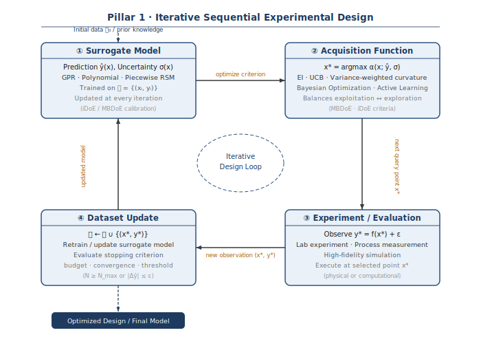
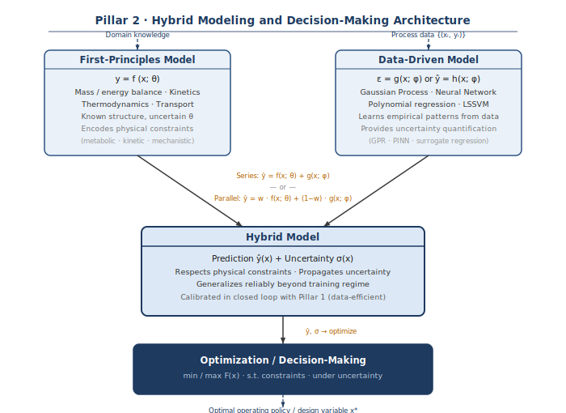
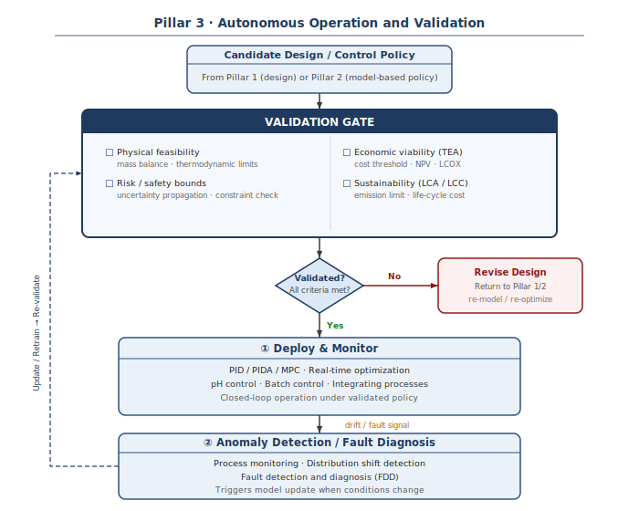

LASER develops computational and experimental methods to enable **autonomous systems engineering** — reducing reliance on manual expert iteration across the full lifecycle of process system design, operation, and validation.

Three fundamental challenges structure our research program:

- **Constraint satisfaction**: Engineering decisions must satisfy hard physical, safety, and economic constraints. Embedding these rigorously within learned or data-driven frameworks remains an open problem.
- **Deep uncertainty**: Real process systems operate under uncertainty in model parameters, disturbances, and structural assumptions — requiring decision-making that is robust by design, not by tuning.
- **Data scarcity**: Informative data is structurally scarce in process operations. Normal-state records dominate while fault events and rare operating modes are underrepresented, demanding data-efficient learning that remains reliable beyond the training regime.

---

## Autonomy Pillars

### Pillar 1 — Autonomous Learning & Experimentation

**Problem:** Characterizing a new process, material, or operating condition typically requires many manually designed experiments, each evaluated and interpreted individually before the next is chosen. Reducing this burden — while increasing the information extracted per experiment — requires principled methods for deciding what to measure next, given what has already been observed.

**Key methods:** Design of experiments (DOE), response surface methodology (RSM), model-based experimental design (MBDoE), variance-weighted sequential design, Bayesian optimization (BO), active learning, informative design of experiments (iDoE)

**What we have worked on:** Sequential design criteria that account for both variance and model curvature; RSM extended with prior knowledge constraints and piecewise structure; MSE-based model-discriminating DOE with subset selection; uncertainty-penalized surrogate optimization

**Representative applications:** Sequential experiment design for process characterization and surrogate model building; piecewise RSM for complex response surfaces with discontinuous operating regimes

{width=100% fig-alt="Iterative loop diagram of sequential experimental design"}

---

### Pillar 2 — Autonomous Modeling & Decision-Making

**Problem:** Real process systems combine known first-principles structure with uncertain or empirical components. Building models that respect physical constraints, propagate uncertainty honestly, and can be used directly in optimization — without a fresh modeling effort per problem — is a persistent bottleneck in autonomous workflows. On the decision side, optimization problems must handle nonlinearity, uncertainty, and multiple competing objectives simultaneously.

**Key methods:** Mathematical modeling (metabolic, kinetic, mechanistic), data-driven and hybrid process identification, surrogate regression with uncertainty quantification, process system optimization, stochastic and two-stage programming, multi-objective decision-making

**What we have worked on:** Mathematical modeling of microalgal intracellular metabolism under varying nutrient conditions; nonlinear process identification using pulse response and frequency-domain methods; direct data-driven controller design via fictitious reference methods; two-stage stochastic optimization for electrochemical CO₂ reduction systems under renewable energy variability

**Representative applications:** Model-based optimization of microalgal lipid production strategy; robust process identification under deterministic disturbances; optimal design of CO₂ electrolysis systems with renewable energy integration

{width=100% fig-alt="Hybrid modeling architecture diagram combining first-principles and data-driven models"}

---

### Pillar 3 — Autonomous Operation & Validation

**Problem:** Deploying a model or decision policy into an operating system requires a continuous validation layer — detecting when the model is wrong, when conditions have shifted, and when a recommended action would violate admissibility requirements. Economic and environmental assessment must be embedded as formal decision criteria, not appended after the fact.

**Key methods:** Process monitoring and anomaly detection, fault detection and diagnosis, PID/PIDA/MPC controller design, process identification for control, real-time optimization

**Validation & Decision Metrics:**

- **Decision objectives and constraints:** Techno-economic analysis (TEA), life cycle assessment (LCA), and life cycle costing (LCC) serve as formal objective functions and constraint checkers — not post-hoc annotations
- **Validator role:** TEA/LCA screens candidate configurations against economic and sustainability thresholds before any deployment decision is made
- **Uncertainty layer:** Price, lifetime, and efficiency uncertainty are propagated through TEA/LCA models for risk-aware configuration selection

**What we have worked on:** Sustainability assessment frameworks for CCU industries under global market dynamics; TEA/LCA of oxy-combustion, blue hydrogen, and carbon utilization processes; PIDA controller design with explicit tuning rules; pH control under buffer and equivalence point transitions; batch PID controller development

**Representative applications:** TEA-guided screening of CO₂ capture and utilization configurations; sustainability assessment of oxy-combustion BECCS and DFM-based methanation; PID/PIDA tuning for industrial process control

{width=100% fig-alt="Validation gateway flowchart for autonomous operation and deployment"}

---

## Iterative Workflow

The three pillars connect through a single **iterative, validation-driven workflow**. Rather than treating learning, modeling, and operation as separate engineering phases, LASER designs them as a coupled end-to-end cycle:

> **Observe → Model → Decide → Validate → Deploy & Monitor → Update**

At the **Validate** step, formal constraints — physical feasibility, economic viability (TEA/LCA when relevant), and risk bounds — are checked before any decision is deployed. The cycle repeats until validation criteria are satisfied. Feedback control is one component within the **Deploy & Monitor** step; it is not the defining identity of the workflow.

---

## Application Areas

LASER applies its autonomous workflow methods across process and industrial domains. Carbon-related systems appear as illustrative cases, not as the defining scope of the lab.

::: {.grid}

::: {.g-col-md-4}
::: {.laser-card}
#### Process & Industrial Systems
- Separation processes (membrane, TSA, adsorption, solvent extraction)
- Reactor design, modeling, and scale-up
- Plant-wide operation and optimization
- Electrification and decarbonization of industrial processes
- Process intensification
:::
:::

::: {.g-col-md-4}
::: {.laser-card}
#### Electrochemical & Energy Systems
- Electrochemical CO₂ reduction to CO and value-added products
- Green and blue hydrogen production
- Solid-state hydrogen storage system modeling and design
- Oxy-combustion systems with BECCS potential
- Direct air capture (TSA-based) and CO₂ utilization
- Energy system integration and techno-economic evaluation
:::
:::

::: {.g-col-md-4}
::: {.laser-card}
#### Bio/Bioprocess Systems
- Microalgae growth and intracellular metabolic modeling
- Photobioreactor and open raceway pond design
- Model-based optimization of lipid and biomass production
- Nutrient management and operational strategy
:::
:::

:::

::: {.callout-note appearance="minimal"}
**Sustainability assessment as a validation layer:** TEA and LCA are embedded in our iterative workflow as decision validators and constraint definers. See [Pillar 3](#pillar-3-autonomous-operation-validation) above.
:::

---

## Selected Outputs

Representative publications are available on the [Publications page](publications.qmd), and funded projects are listed on the [Projects page](projects.qmd).

---

::: {.callout-tip}
## Interested in Collaboration?
We welcome research collaborations and industry partnerships. Please [contact us](about.qmd#contact) for more information.
:::
